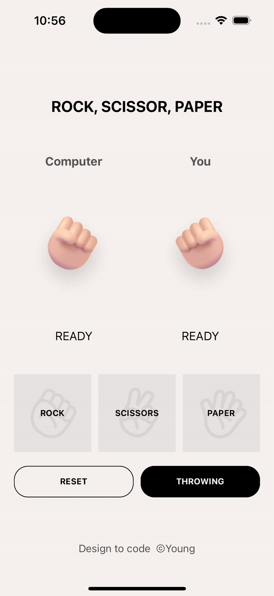
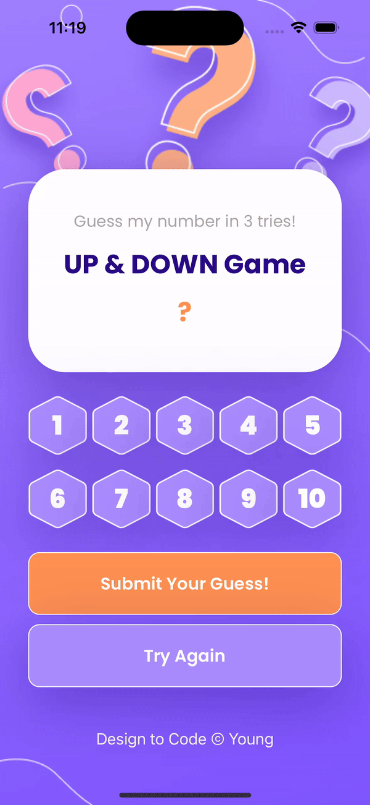

# Mini Game Collection

## 01. Rock-Paper-Scissors Game

### Demo


Design referenced from [Hand Game: Rock paper scissors](https://www.figma.com/community/file/1205039653545793483) by Same Yang.

### Features
- **Simple User Interface**: Users can easily choose rock, paper, or scissors with intuitive buttons.
- **Live Animations**: Visual animations represent the choices of both the player and the computer.


## 02. UP & DOWN Game


Figma Design: [Link](https://www.figma.com/file/J62oigvEAXHzt2tD5gasIZ/UpDownGame?type=design&node-id=0%3A1&mode=design&t=Y26FprkfckwzOKLP-1)

### Features
- **Adaptive Difficulty**: Only 3 tries to guess the correct number with hints on whether the guess was too high or too low.
- **Visual Feedback**: Colorful buttons and engaging backgrounds.
- **End Game Scenarios**: Clear messages and options for retrying upon winning or running out of tries.


### Installation
```bash
git clone https://github.com/YoungSong99/Mini-Game-Collection.git
cd 'the game folder name'
```
open in Xcode and run on an iOS simulator or device
